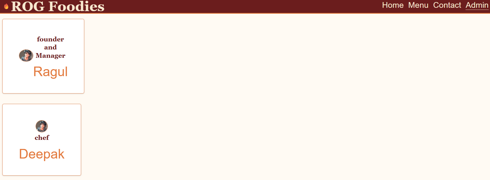

# Ex.07 Restaurant Website
# Date:07.10.2025

# AIM:
To develop a static Restaurant website to display the food items and services provided by them.

# DESIGN STEPS:
## Step 1:
Requirement collection.

## Step 2:
Creating the layout using HTML and CSS.

## Step 3:
Updating the sample content.

## Step 4:
Choose the appropriate style and color scheme.

## Step 5:
Validate the layout in various browsers.

## Step 6:
Validate the HTML code.

## Step 7:
Publish the website in the given URL.

# PROGRAM:
```
home.html
<!DOCTYPE html>
<html lang="en">
<head>
    <meta charset="UTF-8">
    <meta name="viewport" content="width=device-width, initial-scale=1.0">
    <title>Restaurant</title>
    <style>
        body {
            margin: 0;
            font-family: 'Arial', sans-serif;
            line-height: 2;
            color: #131212;
            box-sizing: border-box;
        }

        *, *::before, *::after {
            box-sizing: inherit;
        }

        header {
            background: white;
            color: #060606;
            padding: 5px 10px;
            display: flex;
            align-items: center;
            justify-content: space-between;
            height: 300px;
        }

        header nav a {
            padding-right: 50px;
            text-decoration: none;
            color: #111010;
            font-size: 100px;
            margin: 0 50px;
            transition: color 0.3s ease;
        }

        header nav a:hover {
            color: #dfb019;
        }

        .banner {
            background-size: cover;
            margin: 1% 2%;
            border-radius: 37px;
            display: flex;
            align-items: center;
            justify-content: center;
            padding: 30px 20px;
            background: rgb(67, 69, 71);
            color: white;
            height: 1000px;
            text-align: center;
        }

        .banner-content {
            max-width: 50%;
        }

        .banner-content h1 {
            font-size: 90px;
            margin-bottom: 100px;
        }

        .banner-content p {
            font-size: 1.5rem;
            margin-bottom: 10px;
        }

        footer {
            background: rgb(242, 235, 235);
            color: rgb(0, 0, 0);
            text-align: center;
            padding: 10px 0;
            margin-top: 100px;
            font-size: 100px;
        }

        @media (max-width: 100px) {
            .banner {
                flex-direction: column;
                height: 100px;
                text-align: center;
            }

            .banner-content {
                max-width: 70%;
            }
        }
    </style>
</head>
<body>

    <header>
        <h1>]ROG FOODIES</h1>
        <nav>
            <a href="home.html">Home</a>
            <a href="menu.html">Menu</a>
            <a href="contact.html">Contact</a>
            <a href="admin.html" class="active">Admin</a>
        </nav>
    </header>
    <div class="logo">
        <center></center>
    </div>
    <div class="banner">
        <div class="banner-content">
            <h1>Welcome To "ROG Foodies"</h1>
            <p>Quality is our recipe.</p>
        </div>
    </div>

    <footer>
        <p>Designed by: RAGUL D</p>
    </footer>

</body>
</html>

menu.html
<!DOCTYPE html>
<html lang="en">
<head>
    <meta charset="UTF-8">
    <meta name="viewport" content="width=device-width, initial-scale=1.0">
    <title>Menu</title>
    <style>
        body {
            margin: 0;
            font-family: 'Arial', sans-serif;
            line-height: 1.6;
            color: #333;
            box-sizing: border-box;
        }

        *, *::before, *::after {
            box-sizing: inherit;
        }

        header {
            background: #4CAF50;
            color: #ffffff;
            padding: 10px 20px;
            display: flex;
            align-items: center;
            justify-content: space-between;
            height: 300px;
        }

        header nav a {
            padding: 10px 15px;
            text-decoration: none;
            color: #ffffff;
            font-size:100px;
            margin: 0 10px;
            transition: color 0.3s ease, background 0.3s ease;
            border-radius: 5px;
        }

        header nav a:hover {
            background: #ff5722;
            color: #ffffff;
        }

        .menu-container {
            padding: 20px;
            background: #f5f0f0;
            text-align: center;
        }

        .menu-container h1 {
            font-size: 100px;
            color: #070707;
            margin-bottom: 150px;
        }

        .menu-items {
            display: flex;
            flex-wrap: wrap;
            gap: 300px;
            justify-content: center;
        }

        .menu-item {
            background: white;
            border-radius: 10px;
            box-shadow: 0 4px 10px rgba(0, 0, 0, 0.2);
            width: 1000px;
            overflow: hidden;
            transition: transform 0.3s ease, box-shadow 0.3s ease;
        }

        .menu-item img {
            width: 100%;
            height: 550px;
            object-fit: cover;
        }

        .menu-item:hover {
            transform: scale(1.05);
            box-shadow: 0 6px 15px rgba(0, 0, 0, 0.3);
        }

        .menu-details {
            padding: 15px;
        }

        .menu-details h3 {
            font-size: 85px;
            color: #000000;
            margin-bottom: 8px;
        }

        .menu-details p {
            font-size: 70px;
            color: #555;
            margin-bottom: 10px;
        }

        footer {
            background: #333;
            color: white;
            text-align: center;
            padding: 15px 0;
            margin-top: 20px;
        }

        @media (max-width: 768px) {
            header h1 {
                font-size: 1.5rem;
            }

            .menu-items {
                flex-direction: column;
                gap: 20px;
            }

            .menu-item {
                width: 100%;
            }

            header nav a {
                margin: 0 5px;
            }
        }
    </style>
</head>
<body>

    <header>
        <h1>ROG FOODIES HUB</h1>
        <nav>
            <a href="home.html">Home</a>
            <a href="menu.html">Menu</a>
            <a href="contact.html">Contact</a>
            <a href="admin.html" class="active">Admin</a>
        </nav>
    </header>

    <div class="menu-container">
        <h1>Menu</h1>
        <div class="menu-items">
            <div class="menu-item">
                
                <div class="menu-details">
                    <h3>Biryani</h3>
                    <p>Delicious spiced rice with meat.</p>
                </div>
            </div>

            <div class="menu-item">
                
                <div class="menu-details">
                    <h3>Noodles</h3>
                    <p>Stir-fried noodles with vegetables.</p>
                </div>
            </div>

            <div class="menu-item">
                
                <div class="menu-details">
                    <h3>Chapathi</h3>
                    <p>Soft Indian flatbread.</p>
                </div>
            </div>

            <div class="menu-item">
                
                <div class ="menu-details">
                    <h3>Idly</h3>
                    <p>"Idly" can refer to steamed, fermented savory rice cake from South India.</p>
                </div>
            </div>

            <div class="menu-item">
                
                <div class="menu-details">
                    <h3>Dosa</h3>
                    <p>A dosa is a thin pancake made from a fermented batter of rice.</p>
                </div>
            </div>

            <div class="menu-item">
                
                <div class="menu-details">
                    <h3>Fish</h3>
                    <p>Fish dishes range from quick and hearty stews.</p>
                </div>
            </div>

            <div class="menu-item">
                
                <div class="menu-details">
                    <h3>Fried Rice</h3>
                    <p>Fried rice is a dish of cooked rice that has been stir-fried</p>
                </div>
            </div>

            <div class="menu-item">
                
                <div class="menu-details">
                    <h3>Meals</h3>
                    <p>A meal is an eating occasion that takes place at a specific time and includes prepared food.</p>
                </div>
            </div>

            <div class="menu-item">
                
                <div class="menu-details">
                    <h3>Mutton Briyani</h3>
                    <p>Mutton biryani is a rich and aromatic South Asian rice dish .</p>
                </div>
            </div>
        
            <div class="menu-item">
                
                <div class="menu-details">
                    <h3>Porotta</h3>
                    <p>Porotta  layered flatbread that is a popular street food.</p>
                </div>
            </div>
        </div>
    </div>
    
    <footer>
        <p>Designed by:RAGUL D</p>
    </footer>
    
</body>
</html>

admin .html
 <!DOCTYPE html>
<html lang="en">
<head>
  <meta charset="UTF-8" />
  <meta name="viewport" content="width=device-width, initial-scale=1.0" />
  <title>ROG Foodies | Owner Ragul</title>
  <style>
    
    * {
      margin: 0;
      padding: 0;
      box-sizing: border-box;
    }

    body {
      font-family: 'Poppins', sans-serif;
      background-color: #fffaf3;
      color: #3a2a20;
      line-height: 100px;
      
    }

    
    header {
      background-color: #6b1d1d;
      color: #f7e7ce;
      display: flex;
      justify-content: space-between;
      align-items: center;
      padding: 1rem 2rem;
      border-bottom: 10px solid #e37b40;
    }

    header h1 {
      font-family: 'Georgia', serif;
      font-size: 170px;
      letter-spacing: 1px;
      display: flex;
      align-items: center;
      gap: 0.5rem;
    }

    header h1::before {
      content: "🔥";
      font-size: 70px;
    }

    nav ul {
      list-style: none;
      display: flex;
      gap: 3.5rem;
    }

    nav a {
      color: #f7e7ce;
      text-decoration: none;
      font-size: 100px;
      transition: 0.3s;
    }

    nav a:hover,
    nav a.active {
      border-bottom: 2px solid #f7e7ce;
    }

    
    .owner-section {
      display: flex;
      justify-content: auto
      ;
      align-items: auto;
      padding: 4rem 2rem;
    }

    .owner-card {
      display: flex;
      flex-direction: row;
      align-items: center;
      text-align: center;
      max-width: 1009px;
      background: #fff;
      border-radius: 20px;
      box-shadow: 0 4px 15px rgba(0,0,0,0.15);
      overflow: hidden;
      border: 3px solid #e37b40;
      padding: 200px;
    }

    
    .owner-photo {
      width: 2000px;
      height: 150px;
      border-radius: 50%;
      object-fit: cover;
      border: 6px solid #e37b40;
      margin-bottom: 1rem;
      align-items: center;
    }

    .owner-info h2 {
      color: #6b1d1d;
      font-family: 'Georgia', serif;
      font-size: 80px;
      margin-bottom: 100px;
    }

    .owner-info h3 {
      font-size: 10.2rem;
      font-weight: 500;
      color: #e37b40;
      margin-bottom: 1rem;
    }

    
    .chef-section {
      display: flex;
      justify-content: auto;
      align-items: center;
      padding: 4rem 2rem;
    }
    .chef-card {
      display: flex;
      flex-direction: column;
      align-items: center;
      text-align: center;
      max-width: 100009px;
      background: #fff;
      border-radius: 20px;
      box-shadow: 0 4px 15px rgba(0,0,0,0.15);
      overflow: hidden;
      border: 3px solid #e37b40;
      padding: 200px;
    }
    .chef-photo {
      width: 150px;
      height: 150px;
      align-items: center;
      border-radius: 100%;
      object-fit: cover;
      border: 3px solid #e37b40;
      margin-bottom: 1rem;
    }
    .chef-info h2 {
      color: #6b1d1d;
      font-family: 'Georgia', serif;
      font-size: 80px;
      margin-bottom: 100px;
    }
    .chef-info h3 {
      font-size: 10.2rem;
      font-weight: 500;
      color: #e37b40;
      margin-bottom: 1rem;
    }
    .waiter-section {
      
      display: flex;
      justify-content:auto;
      align-items: flex-start;
      gap:40px;
      margin-top: 50px;
      flex-wrap: wrap;
      padding: 4rem 2rem;
    }

    .waiter-card {
      display: flex;
      flex-direction: row;
      align-items: center;
      text-align: center;
      max-width: 1009px;
      background: #fff;
      border-radius: 20px;
      box-shadow: 0 4px 15px rgba(0,0,0,0.15);
      overflow: hidden;
      border: 3px solid #f99a15;
      padding: 200px;
    }

    
    .waiter-photo {
      width: 60px;
      height: 60px;
      border-radius: 50%;
      object-fit: cover;
      border: 6px solid #f5f3f1;
      margin-bottom: 100px;
      align-items: center;
    }

    .waiter-info h2 {
      color: #6b1d1d;
      font-family: 'Georgia', serif;
      font-size: 80px;
      margin-bottom: 100px;
    }

    .waiter-info h3 {
      font-size: 10.2rem;
      font-weight: 500;
      color: #e37b40;
      margin-bottom: 1rem;
    }
    
    

    
    
    .social-links {
      display: flex;
      justify-content: center;
      gap: 1rem;
      margin-top: 1rem;
    }

    .social-links img {
      width: 32px;
      height: 36px;
      transition: 0.3s;
      filter: sepia(40%) hue-rotate(-10deg);
    }

    .social-links img:hover {
      transform: scale(1.1);
      filter: none;
    }

    
    footer {
      background-color: #6b1d1d;
      color: #f7e7ce;
      text-align: center;
      padding: 1rem;
      font-size: 100px;
      border-top: 4px solid #e37b40;
    }

    
    @media (max-width: 768px) {
      .owner-card {
        width: 90%;
      }
    }
  </style>
</head>
<body>
  
  <header>
    <h1>ROG Foodies</h1>
    <nav>
      <ul>
        <li><a href="home.html">Home</a></li>
        <li><a href="menu.html">Menu</a></li>
        <li><a href="contact.html">Contact</a></li>
        <li><a href="admin.html" class="active">Admin</a></li>
      </ul>
    </nav>
  </header>

  
   <column>
  <section class="owner-section">
    <div class="owner-card">
      

      <div class="owner-info">
        <h2> founder and Manager</h2>
        <h3>Ragul</h3>
        </div>
    </div></section>
   </column>
       <column> <section class="chef-section">
            <div class="chef-card">
                
                <div class="chef-info">
                    <h2> chef</h2>
                    <h3>Deepak</h3>
                </div>
            </div>
        </section>
       </column>
        <column>
       <section class="waiter-section">
            <div class="waiter-card">
                
                <div class="waiter-info">
                    <h2>waiter</h2>
                    <h3>Nithiesh</h3>
                </div>
            </div>
        </section>
      </column>
  <footer>
    <p>&copy; 2025 ROGFoodies | All Rights Reserved</p>
  </footer>
</body>
</html>
contact.html

<!DOCTYPE html>
<html lang="en">
<head>
    <meta charset="UTF-8">
    <meta name="viewport" content="width=device-width, initial-scale=1.0">
    <title>Contact Us</title>
    <style>
        body {
            margin: 0;
            font-family: 'Arial', sans-serif;
            line-height: 1.6;
            font-size: 100px;
            color: #f31313;
            box-sizing: border-box;
            background-color: #f6eeee;
        }

        *, *::before, *::after {
            box-sizing: inherit;
        }

        header {
            background: #007BFF;
            color: #ffffff;
            padding: 10px 20px;
            display: flex;
            align-items: center;
            justify-content: space-between;
            height: 300px;
        }

        header nav a {
            padding: 10px 15px;
            text-decoration: none;
            color: #ffffff;
            font-size: 100px;;
            margin: 0 100px;
            transition: color 0.3s ease;
        }

        header nav a:hover {
            color: #ff5722;
        }

        .contact-section {
            display: flex;
            flex-wrap: wrap;
            justify-content: center;
            padding: 40px 20px;
            background: #ffffff;
            gap: 10px;
            border-radius: 10px;
            box-shadow: 0 4px 10px rgba(0, 0, 0, 0.1);
            margin: 500px;
        }

        .contact-details, .contact-form {
            flex: 1;
            max-width: 7000px;
            margin: 300px;
            background: #f7f4f4;
            padding: 20px;
            border-radius: 10px;
            box-shadow: 0 2px 5px rgba(235, 232, 232, 0.1);
        }

        .contact-details h2, .contact-form h2 {
            font-size: 100px;
            margin-bottom: 15px;
            color: #333;
            text-align: center;
        }

        .contact-details p {
            margin: 10px 0;
            font-size: 100px;;
            color: #555;
        }
        
        .contact-form input, .contact-form textarea {
            width: 100%;
            height: 200%;
            padding: 12px;
            margin: 10px 0;
            border: 1px solid #f8f3f3;
            border-radius: 5px;
            font-size: 100px;
            transition: border-color 0.3s ease;
        }

        .contact-form input:focus, .contact-form textarea:focus {
            font-size:  1000px;
            border-color: #e6870c;
            outline: none;
        }

        .contact-form textarea {
            height: 100px;
        }

        .contact-form button {
            width: 100%;
            height: 100%;
            padding: 12px;
            background: #fbf9f9;
            color: white;
            font-size: 100px ;
            border: none;
            border-radius: 400px;
            cursor: pointer;
            transition:  0.3s ease;
        }

        .contact-form button:hover {
            background: #12100f;
        }

        footer {
            background: #121315;
            color: #ffffff;
            text-align: center;
            padding: 10px 0;
            margin-top: 20px;
        }

        

        @media (max-width: 768px) {
            .contact-details,.contact-form {
                max-width: 100%;
            }
        }
    </style>
</head>
<body>

    <header>
        <h1>ROG Foodies</h1>
        <nav>
            <a href="home.html">Home</a>
            <a href="menu.html">Menu</a>
            <a href="contact.html">Contact</a>
            <a href="admin.html" class="active">Admin</a>
        </nav>
    </header>

    <section class="contact-section">
        <div class="contact-details">
            <h2>Get in Touch</h2>
            <p><strong>Address:123,tig salai,anna nagar,chennai</strong></p>
            <p><strong>Phone:</strong> +91 8072215767</p>
            <p><strong>Email:</strong> ROG@gmail.com</p>
        </div>

        <div class="contact-form">
            <h2>Send Message</h2>
            <form action="/submit-contact" method="POST">
                <label for="name">Name</label>
                <input type="text" id="name" name=" name" placeholder="Enter Your Name" required>

                <label for="email">Email</label>
                <input type="email" id="email" name="email" placeholder="Enter Your Email" required>

                <label for="message">Message</label>
                <textarea id="message" name="message" placeholder="Your Message" required></textarea>

                <button type="submit">Submit</button>
            </form>
        </div>
    </section>

    <footer>
        <p>Designed by: RAGUL D</p>
    </footer>

</body>
</html>

```
# OUTPUT:





# RESULT:
The program for designing software company website using HTML and CSS is completed successfully.
